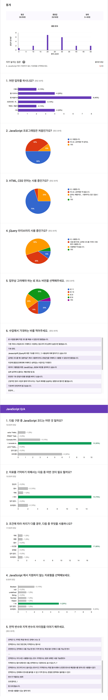

###### JJ CAMP Fundamental

## 진행 내용 목차

참고 학습을 위해 수업 진행 내용을 기록.

> 1. __[02.25](./LOG/0225.md)__ | 컴퓨터적인 사고로 프로그래밍 하기 / 자바스크립트 환경 & 기초 문법

---

### JJ CAMP 첫걸음, 2기 멤버

2기 멤버들은 함께 공부하는 분들과 친해지는 것입니다!  
서로 서로 친하게 지내 봅시다! 10주간 잘 부탁해요!

 | 이름 | 업무 | 소속 | 이메일 | GitHub
--- | --- | --- | --- | --- | --- | ---
01 | 박지훈 | IT | KB | jeehoon0310@gmail.com | [github.com/jeehoon0310](https://github.com/jeehoon0310)
02 | 노현석 | 프리랜서 | | raijin8703@naver.com | [github.com/raijin8703](https://github.com/raijin8703)
03 | 김득원 | 컨설팅(ERD) | MSND | dkim@msnd.kr | [github.com/dkim1004](https://github.com/dkim1004)
04 | 윤종경 | 웹 퍼블리셔 | 다나와 | jkyoon@me.com |
05 | 이정선 | 웹 퍼블리셔 | 와 | lee.jeongsun5@gmail.com | [github.com/jslee0728](https://github.com/jslee0728)
06 | 한창민 | 프리랜서 | | cmhan@fine-tec.com |
07 | 이혜원 | 디자이너 | ENT | hwlee0507@hanmail.net |
08 | 최유리 | 마케터 | SKT | yuriran@naver.com | [github.com/yuriran](https://github.com/yuriran)
09 | 천송희 | 디자이너 | 지투아이넷 | superluckhee@naver.com | [github.com/superluckhee](https://github.com/superluckhee)
10 | 강다인 | 대학생 | 세종대학교 | juhyueon3@naver.com |
11 | 박봉준 | 웹 퍼블리셔 | 아메바 | darksun3@nate.com | [github.com/bongpark](https://github.com/bongpark)
12 | 이상종 | 프리랜서 | | feuuis@naver.com |
13 | 김보민 | 웹 퍼블리셔 | 하나투어유스 | minn1144@naver.com | [github.com/minn1144](https://github.com/minn1144)
14 | 김승현 | 프리랜서 | | dhxn5ak@gmail.com |
15 | 한혜영 | 웹 디자이너 | 인디존 | skylemon7879@naver.com | [github.com/eyeray](https://github.com/eyeray)
16 | 이상구 | 개발 | 엑셈 | tkdrn0842@naver.com | [github.com/tkdrn808](https://github.com/tkdrn808)
17 | 이혜진 | 웹 퍼블리셔 | SBS 콘텐츠 허브 | penguin90@sbs.co.kr | [github.com/penguin90](https://github.com/penguin90)
18 | 유진희 | 프리랜서 | | yashicafx3@naver.com |
19 | 김형진 | 개발 | 씨와이디정보기술 | hjshuma@gmail.com | [github.com/hjshuma](https://github.com/hjshuma)

-

### 사전 설문(Pre Survey) 결과

